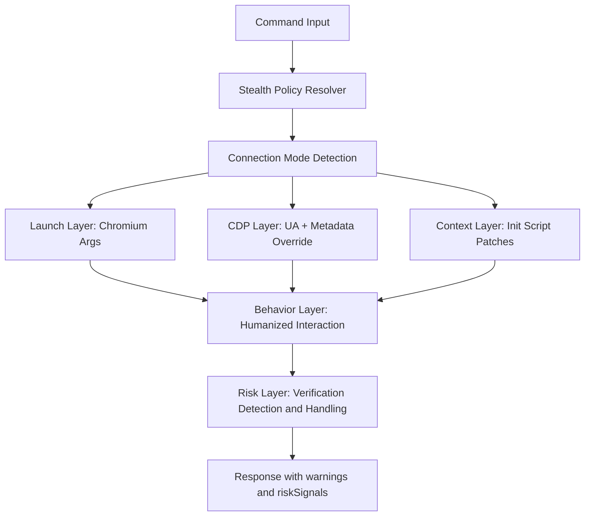
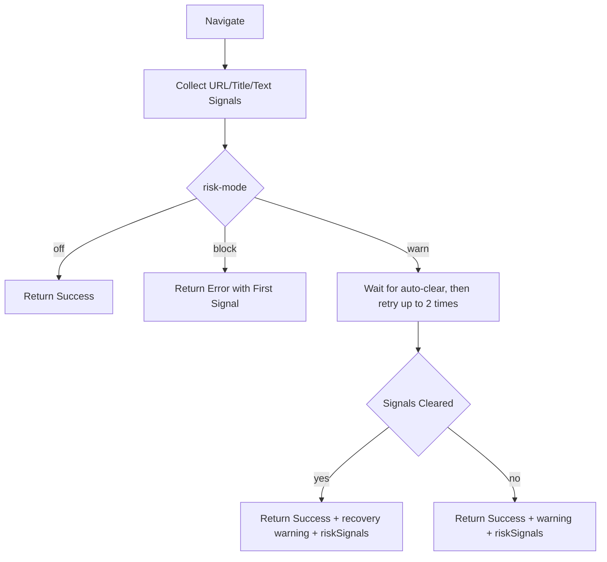

# agent-browser-stealth

Stealth-first fork of `agent-browser` for production browser automation under anti-bot pressure.

This README focuses on stealth architecture and principles. For full command coverage inherited from upstream, use:

- upstream docs: <https://github.com/vercel-labs/agent-browser>
- local help: `agent-browser --help` (short alias: `abs --help`)

## What This Fork Optimizes

- Stealth is always on (legacy `launch.stealth` is accepted but ignored).
- Fingerprint surfaces are patched at multiple layers (launch args, CDP overrides, init scripts).
- Behavioral signals are humanized (typing cadence, cursor path, pacing, retry backoff).
- Region signals are auto-aligned (locale/timezone/Accept-Language) to reduce mismatch risk.
- Verification/captcha handling is policy-driven (`--risk-mode off|warn|block`).

## FAQ: `agent-browser` vs `agent-browser-stealth`

People often ask this: "What's the anti-detection approach compared to `agent-browser-stealth` on npm?"

- `agent-browser-stealth` on npm is the package name for this fork.
- The CLI keeps upstream-compatible command names (`agent-browser` is still the main executable, with `agent-browser-stealth` and `abs` as aliases).
- The practical difference vs upstream `agent-browser` is not one single "stealth switch"; it is a defense-in-depth stack designed for anti-bot pressure.

The core idea is layered hardening across the full automation lifecycle:

1. Connection-aware policy: choose the best available stealth capability by mode (local launch/CDP/cloud provider).
2. Fingerprint hardening: patch launch args, CDP metadata, and init-script surfaces before page code runs.
3. Behavioral humanization: non-uniform typing/mouse/wait patterns instead of perfectly mechanical actions.
4. Region coherence: auto-align locale/timezone/language signals to target geography.
5. Risk-aware control loop: detect verification/captcha signals and handle them with explicit `risk-mode` policy.

Goal: reduce detection probability and improve stability in production automation. Non-goal: "guaranteed bypass" on every target.

## Quick Start

### Install

```bash
npm install -g agent-browser-stealth
agent-browser install
# same CLI, short alias
abs install
```

### Minimal Usage

```bash
agent-browser open https://example.com
agent-browser snapshot -i
agent-browser click @e2
```

### Parallel AI Runs (Isolated Runtime Channel)

Use `--parallel <name>` to run multiple AI flows concurrently without fighting over the same runtime channel.

```bash
agent-browser --parallel worker-a open https://example.com
agent-browser --parallel worker-b open https://example.org
```

`--parallel` is designed for stateless throughput tasks (navigation, extraction, checks). For authenticated flows, keep using one stable `--session-name`.

Default session isolation policy:
- Running a default-session command reaps all non-default daemon sessions (`parallel-*` and legacy named channels).
- This avoids stale daemon reuse and keeps stealth behavior consistent on the primary channel.

| Option | Purpose | Typical Usage |
| --- | --- | --- |
| `--parallel <name>` | Isolate runtime channel for concurrent AI tasks | Stateless/no-login parallel jobs |
| `--session-name <name>` | Persist cookies/localStorage across restarts | Login/auth continuity |
| `--engine <name>` | Choose local browser engine (`chrome`, `lightpanda`) | Native-only engine experiments |

### Daemon Lifecycle

- Daemons auto-shutdown after 10 minutes of inactivity by default.
- Use `--resident` to keep a daemon alive until an explicit `close`.

```bash
agent-browser --resident open https://example.com
# ... long-lived background workflow ...
agent-browser close
```

### Browser Engine Selection

`chrome` remains the default engine. If you want to try [Lightpanda](https://lightpanda.io/docs/open-source/installation), use `--engine lightpanda`; this automatically routes through the native daemon.

```bash
agent-browser --engine lightpanda open https://example.com

export AGENT_BROWSER_ENGINE=lightpanda
agent-browser open https://example.com
```

Lightpanda is headless-only and does not support `--extension`, `--state`, `--profile`, or `--allow-file-access`.

### Headed Mode

Use `--headed` when you want a visible browser window:

```bash
agent-browser --headed open https://example.com

AGENT_BROWSER_HEADED=1 agent-browser open https://example.com
AGENT_BROWSER_HEADED=true agent-browser open https://example.com
```

In this fork, local launches default to headed mode unless headless is explicitly requested. Extension launches also stay headed by default so the stealth/runtime policy remains stable.

### Default: Auto Group Agent Tabs (CDP + Plugin)

```bash
agent-browser open https://example.com
# In CDP mode, tabs are grouped when the tab-group extension is installed

# Override group title
agent-browser --tab-group "My Agent Group" open https://example.com
```

- CDP (`--cdp` / `--auto-connect`) keeps working unchanged.
- If the extension is installed and handshake succeeds, agent tabs are grouped by session:
  - session=`default`: `Agent Browser Stealth`
  - other sessions: `Agent Browser Stealth • <session>`
- If the extension is missing/unavailable, commands continue normally with silent no-op (no warning/error unless `AGENT_BROWSER_DEBUG=1`).
- Env overrides:
  - `AGENT_BROWSER_TAB_GROUP` for base title
  - `AGENT_BROWSER_TAB_GROUP_PLUGIN_ID` for expected extension ID

Install once in Chrome: load unpacked extension from `extensions/tab-group-cdp/` (extension name: `agent-browser-stealth`).

### Extension Capabilities (`agent-browser-stealth`)

- Session window isolation: tabs are kept in their session window when possible.
- Configurable isolation controls: side panel can toggle `strictWindowIsolation` and cross-window activation guard.
- Session-aware grouping: deterministic group color, default session expanded, non-default sessions collapsed.
- Download archive routing: downloads from managed tabs are routed to `agent-browser-stealth/<session>/...`.
- Domain allowlist fallback: when allowlist is configured for a session, extension can force-block out-of-policy tabs to `about:blank`.
- Risk hints (debug only): suspicious host/TLD hints are returned via handshake and printed only when `AGENT_BROWSER_DEBUG=1`.
- Side panel browser controls: open/back/forward/reload, click/fill/press by CSS selector, run shortcut commands, and switch/close tabs.
- Side panel developer signals: capture page console errors/warnings, fetch/xhr network events, command history, and live DOM snapshots.
- Workflow automation: record actions into workflows, run workflows, map workflows to slash shortcuts, and schedule runs (daily/weekly/monthly/yearly).
- Side panel operations console: view session/tab/group mapping, focus a session, keep only one session, clean empty groups, edit session allowlist, and toggle auto-clean.

## Stealth Architecture



### Policy by Connection Mode

| Mode                                    | Stealth Capabilities                                          | Notes                                        |
| --------------------------------------- | ------------------------------------------------------------- | -------------------------------------------- |
| Local Chromium launch                   | Chromium launch args + CDP UA override + context init scripts | Most complete stack                          |
| Existing browser via CDP                | CDP UA override + context init scripts                        | No local Chromium arg injection              |
| Cloud provider (browserbase/browseruse) | Context init scripts                                          | Remote browser runtime controls launch layer |
| Kernel provider                         | Context init scripts + provider-managed stealth               | Provider-side stealth may also apply         |

## Principle 1: Always-On Stealth with Explicit Boundaries

- Stealth defaults to enabled and does not depend on a runtime toggle.
- Project policy forbids:
  - `--profile` / `AGENT_BROWSER_PROFILE`
  - `--channel` / `AGENT_BROWSER_CHANNEL`
- Default CLI policy uses a dedicated automation browser on CDP `localhost:9333`. If `:9333` is unavailable, agent-browser auto-starts Chrome with the persistent profile `~/.agent-browser/chrome-bot-profile`.

## Principle 2: Multi-Layer Fingerprint Hardening

### 2.1 Launch Layer (Local Chromium)

Injected Chromium args:

- `--disable-blink-features=AutomationControlled`
- `--use-gl=angle`
- `--use-angle=default`

If no custom UA is set, the runtime UA is normalized to remove `HeadlessChrome` tokens.

### 2.2 CDP Layer (Browser/Page Targets)

- Uses `Emulation.setUserAgentOverride` to align:
  - `userAgent`
  - `acceptLanguage`
  - `userAgentMetadata` brands and versions
- Applies overrides for existing/new targets, including worker-relevant contexts.
- Forces opaque white background (`Emulation.setDefaultBackgroundColorOverride`) to avoid headless transparency fingerprints.

### 2.3 Context Init-Script Layer (Patch Inventory)

The init script patch set is injected before page scripts and currently includes:

1. `navigator.webdriver` removal (including prototype-level cleanup).
2. CSS webdriver heuristic neutralization (`CSS.supports('border-end-end-radius: initial')` probe).
3. `window.chrome.runtime` bootstrap for missing runtime surfaces.
4. Locale/language normalization (`navigator.language`, `navigator.languages`).
5. Realistic `navigator.plugins` and `navigator.mimeTypes`.
6. `navigator.permissions.query` normalization for notifications.
7. WebGL vendor/renderer masking when SwiftShader indicators are present.
8. `cdc_` property cleanup on document/documentElement.
9. Window/screen dimension normalization (`outerWidth/outerHeight/screenX/screenY`).
10. Screen availability patching (`availWidth/availHeight`).
11. Hardware concurrency stabilization.
12. Notification permission consistency.
13. Active text color heuristic patching.
14. `navigator.connection` normalization.
15. Worker network signal normalization (`downlinkMax`).
16. `prefers-color-scheme` light-mode heuristic neutralization.
17. `navigator.share` exposure.
18. `navigator.contacts` exposure.
19. `contentIndex` exposure.
20. `navigator.pdfViewerEnabled` normalization.
21. Media devices surface normalization.
22. `navigator.userAgent` cleanup (strip `HeadlessChrome`).
23. `navigator.userAgentData` brand cleanup.
24. `performance.memory` stabilization.
25. Default background color patching at script level.

## Principle 3: Behavioral Humanization

- Navigation pacing jitter before `goto` (short randomized delay).
- Typing jitter for `type --delay` and `keyboard type --delay`:
  - per-character randomized delay around the requested base delay (about ±40%).
- Click path humanization:
  - cursor moves on a Bezier-like curve before click.
- Wait supports random ranges (`wait min-max`) for non-uniform timing.

## Principle 4: Region Signal Alignment

Before navigation, the runtime derives region hints from target URL TLD and aligns:

- locale
- timezone
- `Accept-Language`

Examples of built-in mappings include `tw`, `jp`, `kr`, `sg`, `de`, `fr`, `uk`, `in`, `au`.

Manual overrides are supported:

- `AGENT_BROWSER_LOCALE`
- `AGENT_BROWSER_TIMEZONE` (or `TZ`)

## Principle 5: Verification-Aware Risk Control

When a navigation lands on verification/captcha pages, structured risk signals are generated from URL/title/page-text evidence.

`riskSignals` include:

- `code`
- `source` (`url` or `title`)
- `evidence`
- `confidence`

### Risk Mode

- `warn` (default): wait for auto-clear, then retry with randomized backoff and return warnings + `riskSignals`.
- `block`: fail fast once verification/captcha interstitial is detected.
- `off`: skip detection/retry path.

```bash
agent-browser --risk-mode warn open https://example.com
agent-browser --risk-mode block open https://example.com
AGENT_BROWSER_RISK_MODE=off agent-browser open https://example.com
```



## Operational Recommendations

- Prefer `--headed` for high-friction targets.
- Reuse session state with one stable `--session-name` for continuity (when omitted, it defaults to `default`).
- Use `--parallel <name>` only for stateless parallel workloads where higher throughput matters.
- Default-session commands will reap all non-default daemon sessions, so keep parallel workers short-lived.
- Use `--resident` only for deliberate long-running workflows, and close when done.
- Keep locale/timezone consistent with target market.
- For challenge-heavy pages, prefer `--wait-until domcontentloaded` on `open`/`navigate` to avoid `load` stalls.
- Use `--risk-mode block` in strict pipelines that require explicit operator intervention on verification pages.
- For `cookies set`, use either `--url <url>`, or `--domain <domain> --path <path>` together.
- If `--url`, `--domain`, and `--path` are all omitted, the cookie is scoped from the current page URL.

## Validation Scripts

Run public detector checks after stealth changes:

```bash
node scripts/check-sannysoft-webdriver.js --binary ./cli/target/release/agent-browser
node scripts/check-creepjs-headless.js --binary ./cli/target/release/agent-browser
node scripts/check-stealth-regression.js --binary ./cli/target/release/agent-browser
pnpm run check:turnstile-testkey
```

## Doctor Diagnostics

Use `doctor` to quickly diagnose local CDP, sourceURL sanitization, and tab-group plugin readiness:

```bash
agent-browser doctor
agent-browser --json doctor
```

`doctor` checks:

- CDP probe status (preferred `:9333` plus common ports)
- DevToolsActivePort discovery from local Chrome profiles
- CDP Runtime.evaluate sourceURL sanitization probe
- Plugin handshake page context check (internal page vs normal `http(s)` page)
- Tab-group extension handshake (when currently attached in CDP mode)

## Upstream Compatibility

This fork intentionally keeps command workflows close to upstream while concentrating custom behavior in stealth, policy, and anti-detection handling.

## License

Apache-2.0
