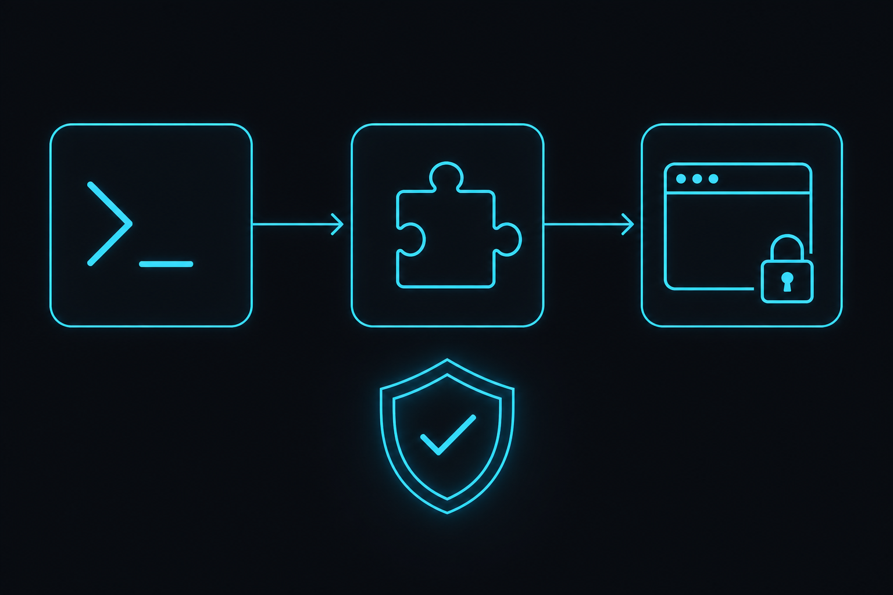
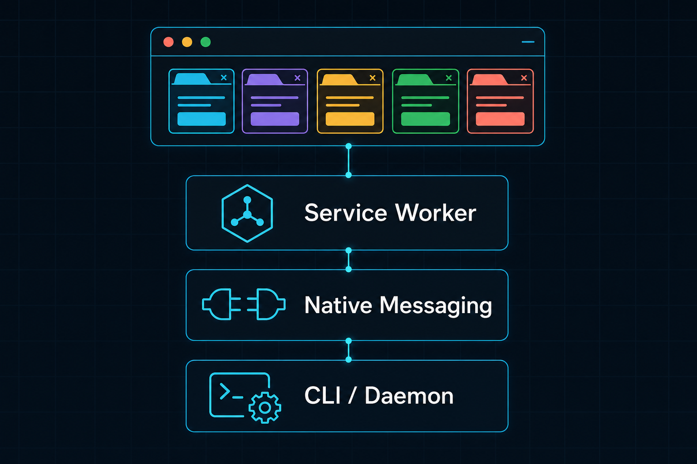

# agent-browser-stealth

[English](README.md) · **简体中文**


[agent-browser](https://github.com/vercel-labs/agent-browser) 的隐身分支 —— 直接连接**你自己**正在用的、已登录的 Chrome，复用你的登录态，对反爬/反自动化系统**完全不可检测**。

基础用法、命令与 API 参考见[上游文档](https://github.com/vercel-labs/agent-browser)。

## 为什么不用 Claude 的 Chrome 插件、web-access 或 Playwright？

每个同类方案只解决了问题的**一部分**。agent-browser-stealth 是唯一全做到的 —— **驱动你自己已登录的 Chrome、任意工具都能调、不弹同意框、不可检测、还能多 agent 并发。**

| | [Claude in Chrome](https://www.anthropic.com/claude/chrome) | web-access / 裸 CDP 端口 | Playwright · Puppeteer · browser-use | **agent-browser-stealth** |
|---|:---:|:---:|:---:|:---:|
| **任意** agent / CLI 都能用（不绑单一 app） | ❌ 仅 Claude | ✅ | ✅ | ✅ |
| 驱动你**真实、已登录**的 Chrome | ✅ | ✅ | ❌ 全新空 profile | ✅ |
| **不弹 "Allow remote debugging?"** | ✅ | ❌ 每次连都弹 | —（自带浏览器） | ✅ 原生消息 |
| **不可检测**（CreepJS） | ~真实 | ~真实 | ❌ 自动化特征 / headless | ✅ **0% stealth，实测** |
| `Runtime.enable` CDP 泄漏（rebrowser） | — | 泄漏 | 泄漏 | ✅ **默认关闭** |
| **多 agent 并发**、标签组隔离 | ❌ | ❌ | ❌ | ✅ |
| 权限面 | 16 个，含 `<all_urls>` | 完整 CDP | 完全控制 | **7 个，无 `<all_urls>`** |

> 一句话：**Claude in Chrome** 很好，但只能给 Claude 用；**web-access / 裸 `--remote-debugging-port`** 每次连接都会弹 Chrome 136+ 的同意框；**Playwright/Puppeteer/browser-use** 启的是**全新**浏览器（没登录、带自动化标记、常 headless → 被识破）。agent-browser-stealth 直接开你**已经登录好**的那个 Chrome，走原生消息扩展，在检测站上读起来就是个 100% 真人浏览器。证据见 [反检测](#反检测)。

## 为什么要 fork


**agent-browser**（上游）启动的是空 profile 的全新浏览器：你得重新登录，网站也能看出是自动化。

**agent-browser-stealth** 连接你**现有**的 Chrome —— cookies、会话、浏览器指纹全是真的，因为它**就是**你的真实浏览器。

| | agent-browser | agent-browser-stealth |
|---|---|---|
| 浏览器 | 启动新 Chrome | 连接你的 Chrome |
| 登录态 | 空，要重新登 | 你现有的会话 |
| 指纹 | 带自动化标记 | 你的真实指纹 |
| 协作 | 独立窗口 | 同一窗口，随时接管 |
| 验证码 | Agent 卡住 | 你点一下，Agent 继续 |

## 工作原理



你的 **agent-browser CLI** 通过 Chrome **原生消息（native messaging）** 和一个小**浏览器扩展**通信 —— 这是本机进程间通道，**无网络端口、无 token、无远程服务器**。扩展用 `chrome.debugger` 驱动你指定的标签页（在你**已登录**的 Chrome 里），再把结果交还给 CLI。全程都在你本机。



每个 `--session` 拿到**自己的彩色标签组**，多个 agent 共用同一个真实浏览器、互不干扰，也不动你自己的标签页。

## 安装

```bash
curl -fsSL https://raw.githubusercontent.com/leeguooooo/agent-browser-stealth/main/install.sh | sh
```

从最新的 [GitHub Release](https://github.com/leeguooooo/agent-browser-stealth/releases) 下载对应平台的预编译二进制，安装 `agent-browser`（以及 `abs` 别名）。无需 npm，无需 token。

### 安装 AI agent skills

```bash
npx skills add leeguooooo/agent-browser-stealth
```

把 `skills/agent-browser` 拉进当前项目，让你的 AI agent 拿到正确的用法和预授权的 bash 权限。

## 连接你的 Chrome

**推荐 —— 浏览器扩展（一键，无弹窗）。** 从 Chrome 应用商店安装 [**agent-browser-stealth** 扩展](https://chromewebstore.google.com/detail/agent-browser-stealth/knfcmbamhjmaonkfnjhldjedeobeafmk)，再注册一次本地桥：

```bash
agent-browser extension install      # 注册原生消息 host（一次性）
agent-browser open https://x.com/home
```

之后 `agent-browser open` 就通过**原生消息**驱动你真实、已登录的 Chrome —— 无调试端口、无 token、**永远不弹 "Allow remote debugging?"**。扩展自动更新、重启不掉，零确认（适合无人值守 / agent 场景）。

<details>
<summary>备选 —— 裸 remote-debugging 端口（会弹同意框）</summary>

不装扩展时，agent-browser 退回用 CDP 连接，而 Chrome 只在带 remote-debugging 端口启动时才暴露它：

```bash
# macOS
open -a "Google Chrome" --args --remote-debugging-port=9222
# Linux
google-chrome --remote-debugging-port=9222
# Windows: 给 Chrome 快捷方式 target 加 --remote-debugging-port=9222
```

然后 `agent-browser open <url>` 自动发现端口。首次连接 **Chrome 136+ 会弹 "Allow remote debugging?"** —— 点一次 Allow（该 Chrome 会话内持续有效）。上面的扩展则完全避开这个框。
</details>

## 用法

```bash
# 连接你的 Chrome 并导航
agent-browser open https://example.com

# 一切都在你已登录的浏览器里进行
agent-browser click "Post"
agent-browser fill "Title" "Hello World"
agent-browser screenshot ./page.png
```

Agent 在你的 Chrome 里操作 —— 你能实时看到开标签、加载、点击。任意时刻都能接管（比如手动过验证码），然后让 agent 继续。

### 独立模式（`--launch`）

```bash
# 临时：全新空 profile —— 无 cookie 无登录（适合 CI / 测试）
agent-browser --launch open https://example.com

# 保留登录：用你真实的 Chrome profile 启动
agent-browser --launch --profile auto open https://x.com/home
```

## 反检测

连接你真实 Chrome 时，我们**零** JS 注入 —— 浏览器指纹完全是真的。指导原则是 **native CDP/Chrome 覆盖优先于 JS 谎言**：被重定义的 getter 本身可被检测，原生覆盖则不会。

- `navigator.webdriver = false` 走 `Emulation.setAutomationOverride`（原生，CreepJS 类说谎检测查不出）。
- **`Runtime.enable` 默认关闭** —— 活着的 `Runtime` 域是可被检测的 CDP 信号（patchright/rebrowser 的 "runtime leak"），即便连的是你真实 Chrome。只在你主动开启 console/错误捕获时才启用。

**实测结果（连接真实 Chrome，中继路径）：**

| 检测站 | 结果 |
|---|---|
| [CreepJS](https://abrahamjuliot.github.io/creepjs/) | **0% stealth · 0% headless**（零 override 痕迹） |
| [bot.incolumitas.com](https://bot.incolumitas.com/) | 全部 OK（overflowTest / overrideTest / puppeteerExtraStealth / worker 一致性） |
| [rebrowser-bot-detector](https://bot-detector.rebrowser.net/) | `runtimeEnableLeak` 🟢 · `pwInitScripts` 🟢 |
| [bot.sannysoft.com](https://bot.sannysoft.com) | 全绿 |

`--launch` 独立模式下会改用一整套隐身补丁，同样过上述检测。

## 与上游的差异

基于 [agent-browser v0.27.0](https://github.com/vercel-labs/agent-browser)：

- **默认 auto-connect** —— `agent-browser open` 连你的 Chrome 而非启新的
- **CDP 原生隐身** —— `Emulation.setAutomationOverride` 而非 JS 补丁
- **双隐身模式** —— 真实 Chrome 零补丁，`--launch` 全补丁
- **`--launch` / `--new`** —— 显式启动独立浏览器
- **CI 自动检测** —— 设了 `CI` 环境变量时走独立模式

所有上游功能（命令、快照、截图、录制、标签、会话等）保持一致。

## License

Apache-2.0（与上游一致）
