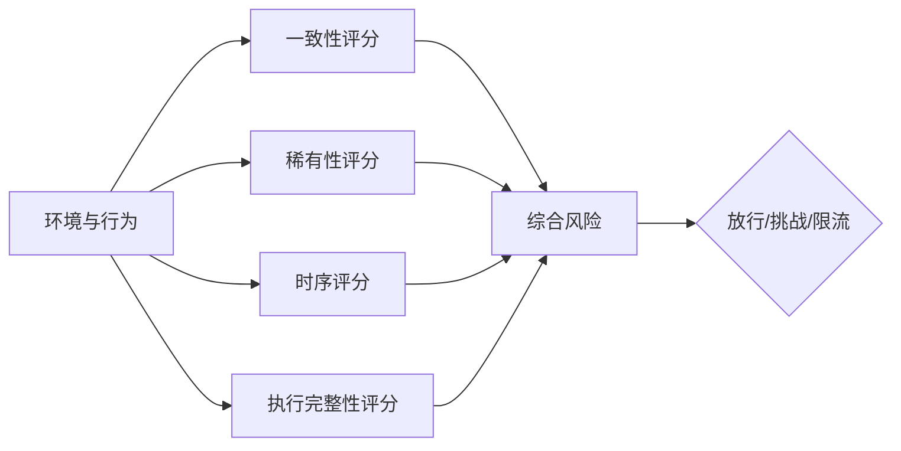
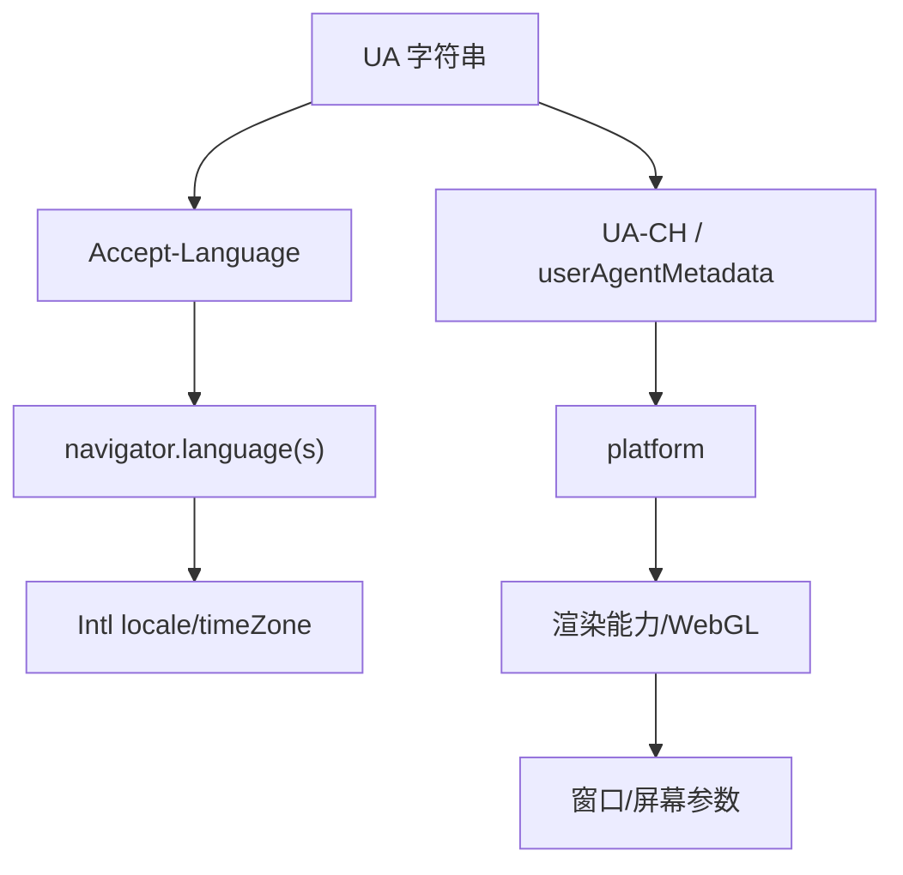
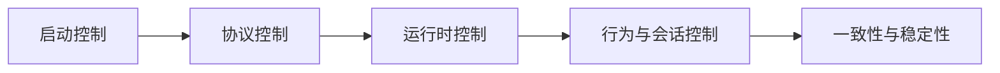

# 浏览器自动化攻防方案设计：检测模型与分层控制面

本文聚焦浏览器自动化的攻防方案设计，按两个部分组织：

1. **原理**：风险评分系统如何形成结论
2. **控制面**：如何用分层设计降低风险与波动

本文不包含命令行操作与工程实现步骤。

Turnstile 专题内容见：
[Cloudflare Turnstile 攻防方案设计：系统原理与控制面](https://blog.misonote.com/zh/posts/cloudflare-turnstile-stability-principles/)

---

## 一、原理

### 1.1 风险评分不是单点命中

高风控站点的“是否挑战/是否降权”通常来自多维评分，而不是某一条规则的二元判断。

主要输入维度：

1. **一致性**：同一身份在不同表面是否互相矛盾
2. **稀有性**：低频异常组合是否出现
3. **时序性**：行为时间序列是否呈机械统计特征
4. **执行完整性**：关键链路（挑战脚本、跨域资源、worker）是否被破坏

### 1.2 一致性：约束集合而非单点修饰

一致性问题的本质是“同一身份在多个观测面上的约束必须同时成立”。

#### 1.2.1 约束集合示意

可以把身份一致性建模为“约束图”：

图中每条边表示“两个表面必须相互一致”，否则会形成冲突分值。

#### 1.2.2 典型冲突类型

- UA 显示平台/版本与 UA-CH 不一致
- `Accept-Language` 与 `navigator.languages` 不一致
- `Intl` 时区与偏移/地区推断不一致
- 设备声明与渲染能力组合异常

工程含义：

- 修一个点可能打破另一个点
- 设计顺序应是“先定约束集合，再决定每个表面如何满足约束”

### 1.3 稀有性：组合风险而非单值风险

稀有性来自“低频组合”，其危险性来自共现而非单项。

可以将稀有性理解为“联合分布”偏离：

- 单项偏离：可被容忍
- 多项共现偏离：风险迅速累积

工程含义：

- 目标是减少低频组合在同一会话内叠加
- 目标不是拟合某个固定画像

### 1.4 时序性：统计特征而非行为语义

行为检测通常关注统计分布特征：

- 低方差：动作间隔过于稳定
- 强周期：间隔呈固定节奏
- 强同步：不同类型动作间隔一致

工程含义：

- 行为治理的目标是“分布塑形”（variance/jitter/backoff）
- 行为治理不是“添加更多动作”

### 1.5 执行完整性：上游条件

执行完整性属于“系统是否能正确运行”的前置条件。

- challenge 脚本、跨域 iframe、跨域 worker 的语义被破坏时，失败率会显著上升
- 此类失败可能与“是否被识别”为不同类别的问题

工程原则：

> 执行链路保护优先于信号修饰。

---

## 二、控制面（分层设计）

### 2.1 控制面总览

攻防方案可以拆为四层控制面：

1. **启动控制**：治理启动早期显式风险
2. **协议控制**：治理协议层身份一致性
3. **运行时控制**：治理页面脚本可观测表面
4. **行为与会话控制**：治理时序分布与上下文漂移

### 2.2 启动控制

目标：降低会话早期显式风险。

设计约束：

- 只处理高置信度自动化标识
- 避免引入与协议层/运行时层不一致的改动

### 2.3 协议控制

目标：将身份约束集合落实到协议层输出。

设计要点：

- 将 UA 与 UA-CH 视为同一约束集合的不同投影
- 覆盖范围需要与目标（页面/worker/子目标）一致

### 2.4 运行时控制

目标：覆盖高频探测面，同时保证不破坏执行语义。

设计要点：

- 优先治理高频、可解释的探测路径
- 对跨域挑战链路对象设置严格注入边界

### 2.5 行为与会话控制

目标：塑形时间分布，减少上下文漂移。

设计要点：

- 行为治理以统计分布为目标（variance/jitter/backoff）
- 会话治理以一致上下文为目标（避免身份漂移）

### 2.6 挑战场景控制面摘要（Turnstile）

Turnstile 场景下的关键控制面可抽象为：

1. 能力令牌语义：服务端验证、有限时效、单次消费
2. 作用域收缩：`hostname/action/cdata` 收缩滥用空间
3. 执行链路保护：跨域脚本/iframe/worker 语义保护
4. 摩擦与安全分离：clearance 属于体验层，不替代安全决策层

该摘要用于将 Turnstile 纳入统一控制面框架；细节见专题文章。

---

## 三、方案设计优先级

控制面设计通常按以下优先级推进：

1. 执行完整性（保证链路可运行）
2. 一致性约束集合（消除跨表面矛盾）
3. 稀有性控制（避免低频组合叠加）
4. 时序分布塑形（降低机械统计特征）
5. 体验优化（降低重复挑战摩擦）

该顺序的含义是先保证“系统正确性”，再优化“稳定性与摩擦”。
