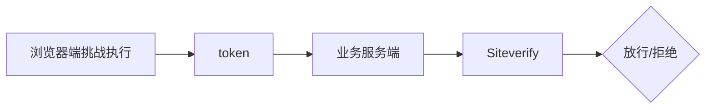
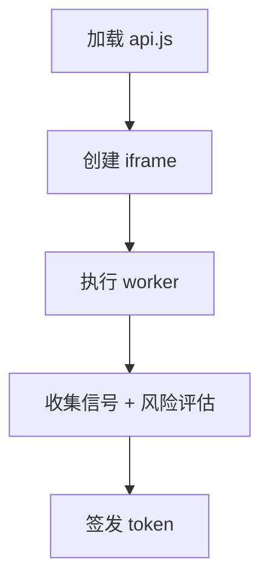
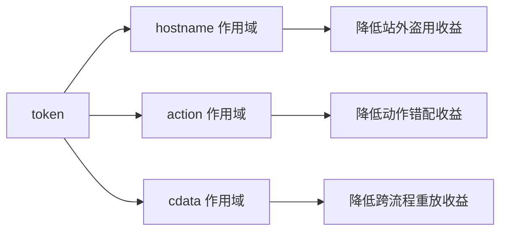
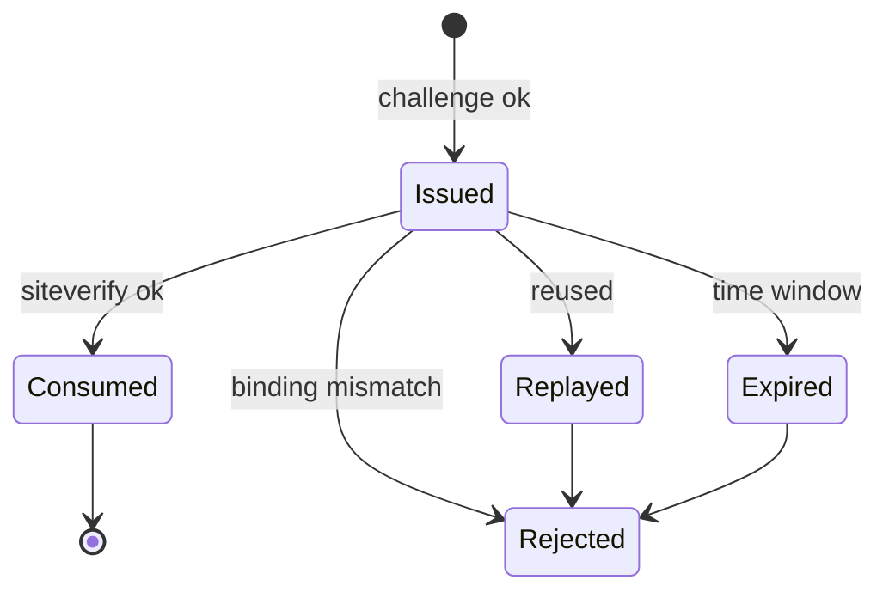
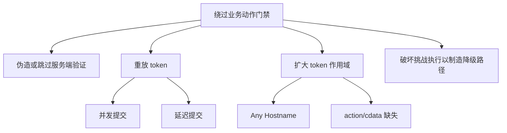
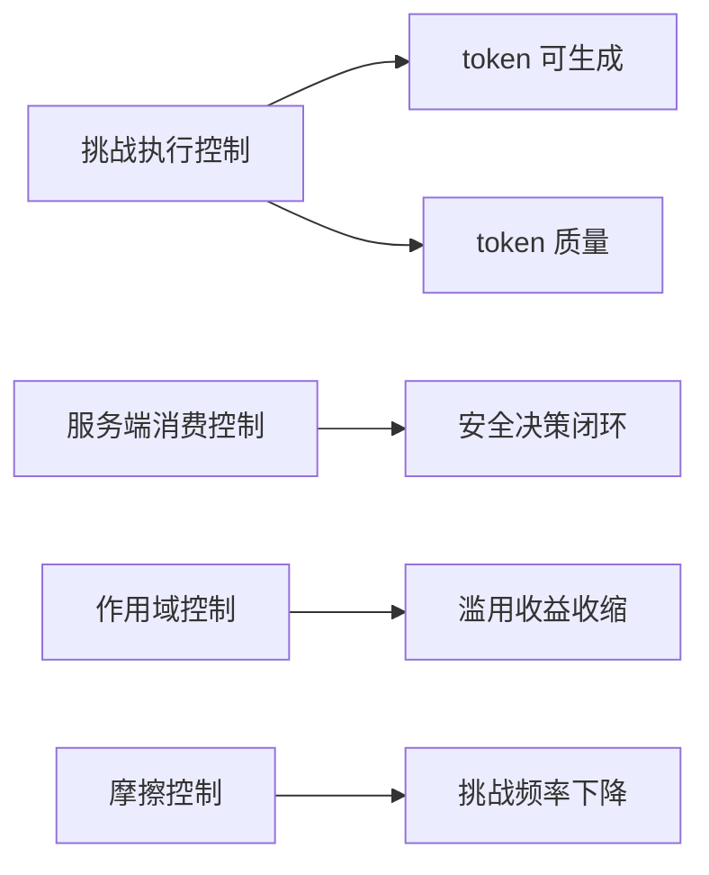

# Cloudflare Turnstile 攻防方案设计：系统原理与控制面

本文聚焦 Turnstile 的攻防方案设计：

1. **系统原理**：token 的安全语义、挑战执行链路、风险评分的输入输出
2. **控制面设计**：在不同攻击面下，哪些约束是必要的、哪些约束容易引入副作用

本文不包含命令行操作与工程实现步骤。

---

## 一、系统原理

### 1.1 Turnstile 是“能力令牌”系统

Turnstile 的本质是签发一个短生命周期、单次消费的能力令牌（capability token）。

- **签发端**：浏览器端完成挑战执行后获得 token
- **消费端**：业务服务端通过 Siteverify 验证 token 并决定是否放行

关键含义：

- 前端任何“通过”状态都不是业务放行条件
- 业务放行条件是“token 被正确消费”

### 1.2 Token 的三条安全语义

token 的安全语义可以抽象为三条约束：

1. **必须服务端验证**：不允许仅以前端回调作为依据
2. **有限时效**：token 超过时效窗口即失效
3. **单次消费**：同一 token 重复消费应失败

这三条语义分别封装了三个常见攻击目标：

- 伪通过：绕过服务端验证
- 延迟提交：绕过时效窗口
- 重放/并发：绕过单次消费

### 1.3 挑战执行链路是“跨域执行系统”

Turnstile 的 token 产生依赖多组件协作，且跨域链路占主导：

- `api.js` 脚本
- challenge iframe
- challenge worker
- 跨域资源请求

该链路的工程含义：

- 任何对跨域脚本/iframe/worker 的语义改写，都可能导致 token 生成失败或质量下降
- token 失败不一定意味着“被识别”，也可能是“链路被破坏”

### 1.4 风险评分：输入不是“真假”，而是“自洽程度”

挑战执行阶段会收集环境与行为信号，形成风险评分。

- **信号输入**：环境一致性（UA/UA-CH、语言/时区、渲染能力、能力暴露）
- **行为输入**：时序分布（方差、周期性、同步性）

风险评分的关键不是“拟合某种固定画像”，而是“同一身份在多表面是否自洽”。

### 1.5 作用域绑定：hostname / action / cdata

服务端校验时提供用于绑定业务语义的字段：

- `hostname`：token 允许的站点作用域
- `action`：token 允许的动作作用域
- `cdata`：token 允许的上下文作用域

这些字段的作用是“收缩 token 可被滥用的范围”，而不是“提高通过率”。

### 1.6 Token 状态机（能力令牌视角）

从能力令牌视角，token 生命周期可抽象为：

设计目标是让“非法路径”快速失败，并且失败类型可被服务端语义区分。

### 1.7 攻击树（高层）

Turnstile 的主要攻击目标可以抽象为：

该攻击树强调设计重点：

- 安全决策必须在服务端闭环
- token 必须被作用域收缩并按语义消费

---

## 二、控制面设计（攻防视角）

### 2.1 控制面分层

Turnstile 防线可以分为四层控制面：

1. **挑战执行控制**：保证脚本/iframe/worker 跨域链路完整
2. **服务端消费控制**：保证 token 的语义被正确消费
3. **作用域控制**：收缩 `hostname/action/cdata` 的可用范围
4. **摩擦控制**：clearance 用于降低挑战摩擦（不作为安全决策依据）

### 2.2 挑战执行控制：跨域语义保护优先

挑战执行链路对跨域执行语义高度敏感。

原则：

- 跨域脚本/iframe/worker 避免语义改写
- 所有指纹修饰必须先满足“不破坏挑战执行”这一硬约束

该原则的工程含义：

- “执行完整性”是上游条件
- “信号修饰”是下游优化

### 2.3 服务端消费控制：把 token 当作能力消费

服务端消费控制的设计关键在于“放行条件定义”，而不是“接口调用细节”。

放行条件应体现三类约束：

- 真实性：校验 `success`
- 作用域：校验 `hostname`
- 语义绑定：校验 `action/cdata`

并且必须贯彻 token 的两个安全语义：

- 时效性：过期拒绝
- 单次性：重放拒绝

从攻防角度，该层解决的是“绕过与重放”。

### 2.4 作用域控制：Hostname Management 与 Any Hostname

Hostname 管理解决“站外盗用”的攻击面。

- 启用 Hostname Management：收缩 token 可用站点范围
- 启用 Any Hostname：扩大 token 可用站点范围

设计结论：

- Any Hostname 不是“更灵活”，而是“扩大攻击面”，必须用更强的服务端约束做补偿控制（来源域白名单 + 业务绑定）。

### 2.5 摩擦控制：Pre-clearance 与 cf_clearance 的边界

Pre-clearance 通过后可产生 clearance，用于后续 WAF 挑战联动。

边界定义：

- clearance 用于体验层（降低重复挑战摩擦）
- Siteverify 用于安全决策层（业务放行依据）

将两者混用会引入“体验信号替代安全信号”的设计缺陷。

### 2.6 高对抗场景：代理池与设备关联

在代理池与分布式滥用场景中，单一 IP 维度约束容易失效。

设计方向是引入更稳定的关联维度（例如设备级 ephemeral id），用于聚类与阈值策略。

该层属于平台能力与业务风控的交界：

- 平台提供关联信号
- 业务定义动作分层、阈值与处置策略

---

## 三、方案设计优先级

Turnstile 攻防设计通常按以下优先级推进：

1. 服务端消费语义闭环（真实性 + 作用域 + 绑定 + 单次性 + 时效性）
2. 挑战执行链路完整性（跨域语义保护）
3. 信号一致性（减少跨字段矛盾）
4. 行为时序（降低机械分布）
5. 体验优化（clearance 等摩擦控制）

该顺序的含义是先定义“正确的安全决策”，再优化“挑战摩擦与通过率波动”。

---

## 官方参考（概念与配置）

- Widgets: <https://developers.cloudflare.com/turnstile/concepts/widget/>
- Widget configurations: <https://developers.cloudflare.com/turnstile/get-started/client-side-rendering/widget-configurations/>
- Server-side validation: <https://developers.cloudflare.com/turnstile/get-started/server-side-validation/>
- CSP: <https://developers.cloudflare.com/turnstile/reference/content-security-policy/>
- Hostname management: <https://developers.cloudflare.com/turnstile/additional-configuration/hostname-management/>
- Any Hostname: <https://developers.cloudflare.com/turnstile/additional-configuration/hostname-management/any-hostname/>
- Pre-clearance: <https://developers.cloudflare.com/turnstile/additional-configuration/hostname-management/pre-clearance/>
- Cloudflare clearance: <https://developers.cloudflare.com/cloudflare-challenges/concepts/clearance/>
- Ephemeral IDs: <https://developers.cloudflare.com/turnstile/additional-configuration/ephemeral-id/>
